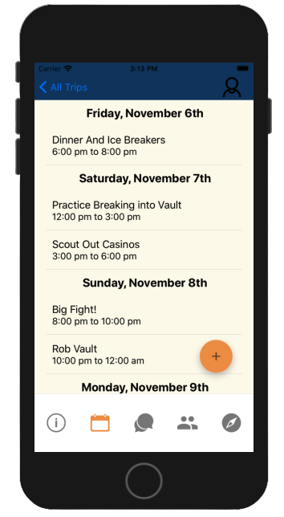
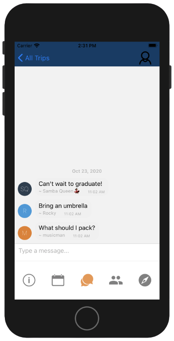
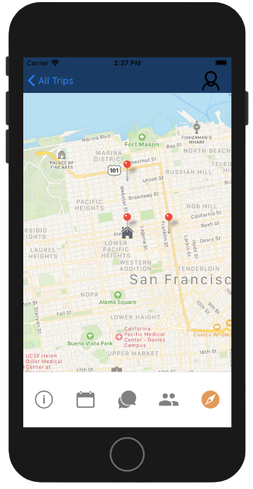

# Day Tripper!
Our project is a mobile application that helps to plan group trips.
Note: currently works for iOS only.
# Motivation
To create an application that is a single source for the creation, organization, and communication of group trips.
# Screen Shots

 

# Tech Stack
Our application was developed with React native, Redux, Express, and PostgreSQL.
# Features
- Creating/Updating Trips
- Creating/Updating Events in Itinerary
- Add locations to events and trips
- Add/Delete guests in the guest list
- Chat with invited guests
- See overview map of events
# Installation
### Install Expo and iOS simulator
1. `npm install -g expo-cli`
2. Follow instructions to install the iOS simulator: https://docs.expo.io/workflow/ios-simulator/
3. `npm install` on both client-side and server-side sub-directories
# How to use
### If testing locally, follow steps 1 - 4. If running with deplyed heroku server, ignore steps 1 - 4:
1. Create a postgres database: `createdb daytripper`
2. Run seed: `node server-side/db/seed.js`
3. In client-side/serverUrl.js, uncomment line 1 and comment out line 3
4. In the server-side directory, `npm run start-dev` to start the server
5. In the client-side directory, `npm start` to start the expo server.
6. In the development tools, open the iOS simulator
7. Create a user using the signup page
8. Press the create trip button to create trips and invite guests. Note: creating trips gives you host privileges to edit and delete trips, events, and guests
9. Navigate to the itinerary tab to add events
10. Access the chat room for invited trips to talk with guests
11. View map of all events by navigating to the map tab
